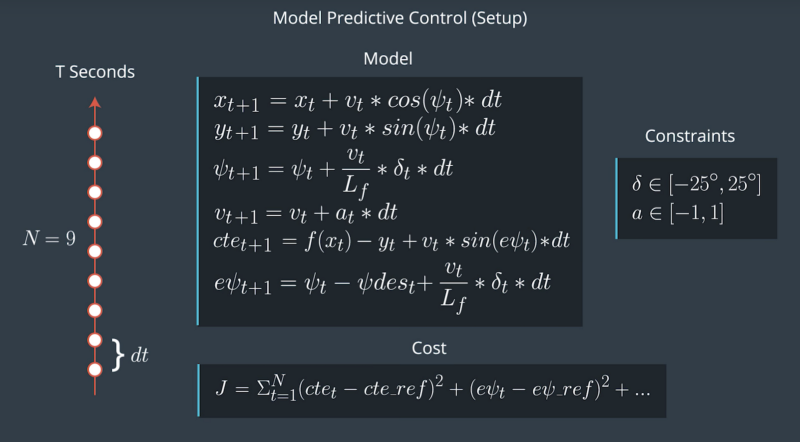
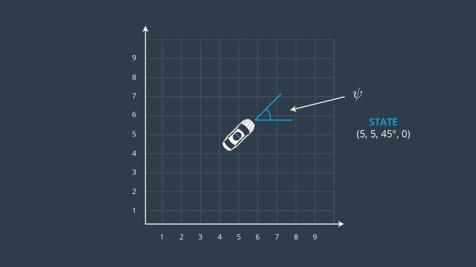
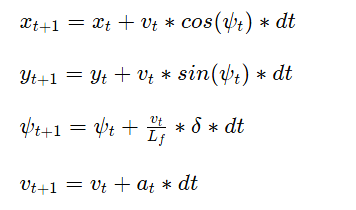
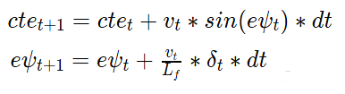

# Model Predictive Control
Model Predictive Control considers the task of following a trajectory as an optimization problem in which the solution is the path the car should take. The idea is to simulate different actuator inputs (steering, acceleration and braking) and predict a resulting trajectory by selecting the one with the minimum cost. The car follows that trajectory and gets new input to calculate a new set of trajectories to optimize. The model utilizes the called “receding horizon controller” which performs a trajectory recalculation for every new state, since the defined trajectory is just an approximation.



## The Model
I used a global kinematic model, which is a simplification of a dynamic model that ignores tire forces, gravity and mass.
The state model is represented by the vehicles position, orientation angle (in radians) and velocity.

Position (_x,y_), heading (_ψ_) and velocity (_v_) form the vehicle state vector:$\psi$

State: _[x,y,ψ,v]_


There are two actuators. Stearing angle (_δ_) is the first one, it should be in range [-25,25] deg. For simplicity the throttle and brake represented as a singular actuator (_a_), with negative values signifying braking and positive values signifying acceleration. It should be in range [-1,1].

Actuators: _[δ,a]_

The kinematic model can predict the state on the next time step by taking into account the current state and actuators as follows:



where _Lf_ measures the distance between the front of the vehicle and its center of gravity. 
Errors: cross track error(distance of vehicle from trajectory) (_cte_) and orientation error (difference of vehicle orientation and trajectory orientation) _ψ_ error (_eψ_) were used to build the cost function for the MPC. They could be updated on a new time step using the following equations:



The simulator passes via a socket, ptsx & ptsy of six waypoints (5 in front, 1 near the vehicle), the vehicle x,y map position, orientation and speed (mph).This data after being transformed into the vehicle map space, with new cross track error and orientation error calculated, is then passed into the MPC (Model Predictive Control) solve routine. It returns, the two new actuator values, with steering and acceleration (i.e. throttle) and the MPC predicted path (plotted in green in the simulator).

Constraint costs were applied to help the optimiser select an optimal update. Emphasis was placed on minimising orientation error and actuations, in particular steering (to keep the lines smooth).

```   
   // Reference State Cost
    // TODO: Define the cost related the reference state and
    // any anything you think may be beneficial.
    // The part of the cost based on the reference state.
    for (int i = 0; i < N; i++) {
      fg[0] += CppAD::pow(vars[cte_start + i] - ref_cte, 2);
      fg[0] += 2 * CppAD::pow(vars[epsi_start + i] - ref_epsi, 2);
      fg[0] += CppAD::pow(vars[v_start + i] - ref_v, 2);
    }

    //
    // Setup Constraints
    //
    // NOTE: In this section you'll setup the model constraints.
    // Minimize the use of actuators.
    for (int i = 0; i < N - 1; i++) {
      fg[0] += CppAD::pow(vars[delta_start + i], 2);
      fg[0] += CppAD::pow(vars[a_start + i], 2);
    }

    // Minimize the value gap between sequential actuations.
    for (int i = 0; i < N - 2; i++) {
      fg[0] += 20000 * CppAD::pow(vars[delta_start + i + 1] - vars[delta_start + i], 2);
      fg[0] += 10 * CppAD::pow(vars[a_start + i + 1] - vars[a_start + i], 2);
    }
```

## Timestep Length and Elapsed Duration (N & dt)
The MPC optimiser has two variables to represent the horizon into the future to predict actuator changes. They are determined by N (Number of timesteps) and dt (timestep duration) where T (time) = N * dt.

To help tune these settings, I copied the mpc_to_line project quiz, to a new project mpc_to_waypoint, and modified it to represent the initial state model to be used with the Udacity simulator. I was able to get good results looking out 3 seconds, with N = 15 and dt = 0.2. The following output are plots of 50 iterations from the initial vehicle state:


## Polynomial Fitting and MPC Preprocessing


## Model Predictive Control with Latency


## Final simulation


## Comments 
